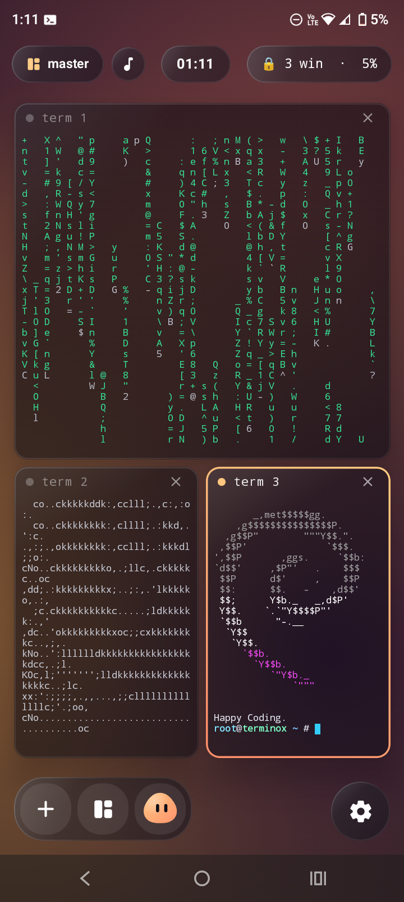
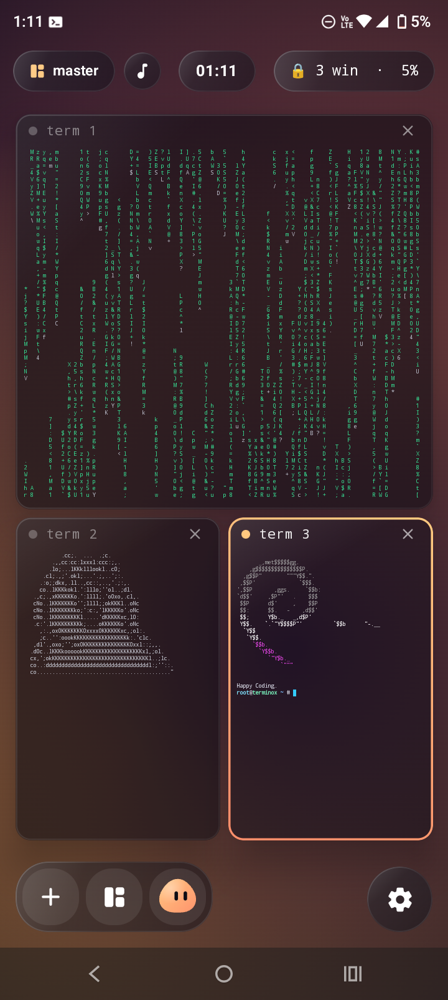
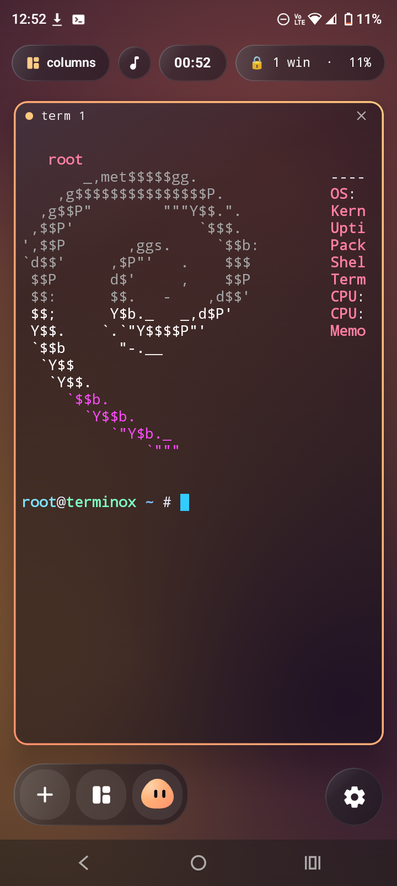

<div align="center">

# terminox

**A Hyprland-style tiling terminal for Android, running real Debian. No root needed.**

Glass windows that tile themselves · real `apt` from Debian's mirrors · an AI blob that runs commands for you · live synced lyrics · runs forever in the background

  

</div>

## Features

- **Real Linux.** A full Debian 13 (trixie) system from the official image server, booted with [proot](https://github.com/proot-me/proot). You're root inside it, with no device root. `apt install` anything from Debian's mirrors; `pkg` is an alias.
- **Tiling window manager.** Dwindle, master, grid and Niri-style scrolling columns, with springy animations. Tap **＋** to spawn a terminal.
- **PositioningNScale.** The widget button lets you drag windows to swap them, float them, and resize them from the corner.
- **Liquid glass.** Frosted windows over your wallpaper (image, looping video, or animated aurora) and a rotating gradient border on the focused window.
- **The blob.** A Gemini agent: *"open a terminal and do neofetch"*. It types the commands itself, reads the output, installs what's missing, and asks before anything destructive. Ask it for root and you get a **GET ROOT** button.
- **Music player.** Search any song and it plays with time-synced lyrics behind your windows, or run `ter-music` in the terminal. Lyrics pause during ads.
- **`terminox-lock`** keeps every session alive with the screen off.
- **Huge settings.** 7 themes (Hyprland, Niri, Catppuccin, Tokyo Night, Rosé Pine, Nord, Sway), gaps, rounding, borders, blur, animation speed and bounce, layouts, 6 terminal color schemes, and pinch-to-zoom text.
- **The intro.** A minute-long, beat-synced trailer with a soundtrack generated in code.

## Install

Grab `terminox.apk` from [Releases](../../releases), install it, and follow the intro. The first launch downloads Debian (~90 MB).

Requires Android 7+ on arm64, armv7 or x86_64.

## Terminal commands

| Command | What it does |
|---|---|
| `apt install <pkg>` / `pkg install <pkg>` | Install from Debian's mirrors |
| `terminox-lock` / `terminox-unlock` | Keep sessions running in the background |
| `ter-music [song artist]` | Pick a song and watch synced lyrics in the terminal |
| `terminox-help` | Quick reference |
| `ls /sdcard` | Your phone storage (after allowing it) |

Tip: **CTRL + L** clears the screen instantly.

## The blob (AI)

Get a free key at [aistudio.google.com](https://aistudio.google.com) and paste it in **Settings › AI**. New `AQ.` keys and older `AIza` keys both work. It uses Gemini 3.8 Flash and falls back to 3.7, then 3.6.

## Build from source

```bash
git clone https://github.com/ionlycomedheretotestlol/terminox
cd terminox
./gradlew assembleRelease   # needs JDK 17 and the Android SDK
```

Optional:

- **Built-in Gemini key:** add `GEMINI_API_KEY=...` to `local.properties` (gitignored). Don't ship APKs with your key in them.
- **Release signing:** set `TERMINOX_KEYSTORE`, `TERMINOX_KEYSTORE_PASSWORD`, `TERMINOX_KEY_ALIAS` and `TERMINOX_KEY_PASSWORD`. In CI, add the repo secrets `TERMINOX_KEYSTORE_BASE64` (plus those three) and pushing a `v*` tag publishes a signed release. Without them, builds use a debug key.

UI screenshots render on the JVM with Robolectric + Roborazzi (`app/src/test/.../Shots.kt`).

## How it works

- **Terminal:** Termux's `terminal-emulator` / `terminal-view` libraries (a real PTY).
- **Linux:** a static proot build ships as `libproot.so` in the APK and boots Debian's rootfs from `images.linuxcontainers.org`. The app targets SDK 28 so programs can run from app storage.
- **App ↔ shell:** helper commands drop small files in `/run/terminox`, which the app watches.
- **Music:** iTunes Search for results; lyrics from LRCLIB, then NetEase, then lyrics.ovh; video IDs from Piped/Invidious search; playback through YouTube's official embedded player.

## Credits & licenses

Terminox is MIT licensed (see [LICENSE](LICENSE)). It bundles or uses:

- [termux terminal libraries](https://github.com/termux/termux-app): Apache-2.0
- [PRoot](https://github.com/green-green-avk/proot): GPL-2.0, prebuilt by [build-proot-android](https://github.com/green-green-avk/build-proot-android) (see `app/src/main/jniLibs/NOTICE.md`)
- [Debian](https://www.debian.org) images from [linuxcontainers.org](https://images.linuxcontainers.org)
- [LRCLIB](https://lrclib.net), NetEase Cloud Music, lyrics.ovh, the iTunes Search API, [Piped](https://github.com/TeamPiped/Piped), [Invidious](https://invidious.io)

Theme names are tributes to the compositors and color schemes that inspired them; Terminox isn't affiliated with any of them.
